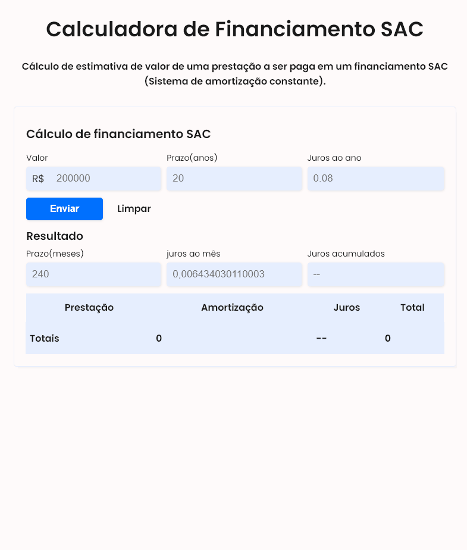
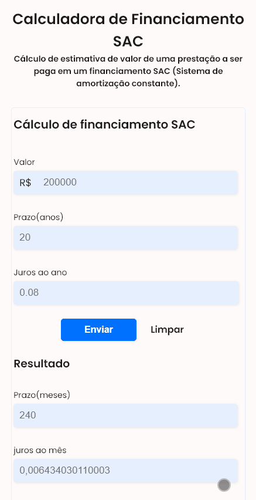

# Calculadora de Financiamento SAC

## 💻 Aplicação

### Este trabalho foi desenvolvido durante o Bootcamp IGTI 😀
 

A calculadora de financiamento SAC, é uma Aplicação Web para realizar cálculos de financiamento de casa. Esta aplicação é um trabalho prático, passado durante o Bootcamp do [IGTI em parceria com o Tech PAN](https://www.igti.com.br/bootcamp/desenvolvedor-tech-pan).

Durante este projeto pude aprender muitas técnicas de programação legais, além de melhor desenvolver minhas habilidades em lógica.

## Links
Confira o deploy: [Simulação de Financiamento](https://financing-system.netlify.app/)

 
 

## Versão Web

    

 
 

## Versão Mobile

    

 
 

## 🔨 Tecnologias e Ferramentas Utilizadas
 - HTML5
 - CSS3
 - JavaScript
 - VSCode

#### Em breve mais atualizações, até logo 💻👋
